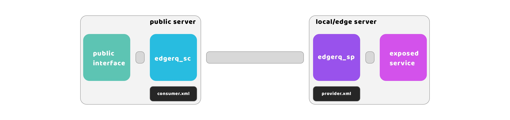
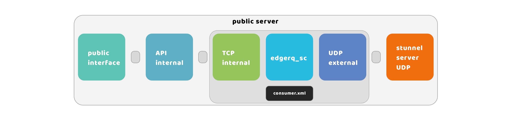
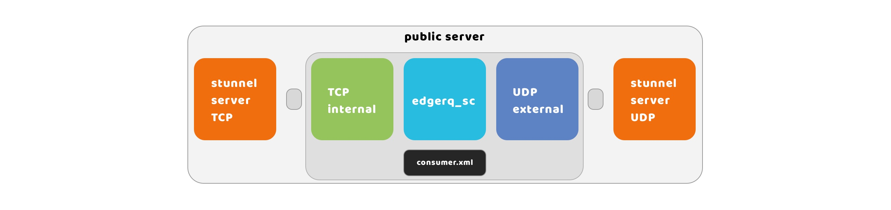
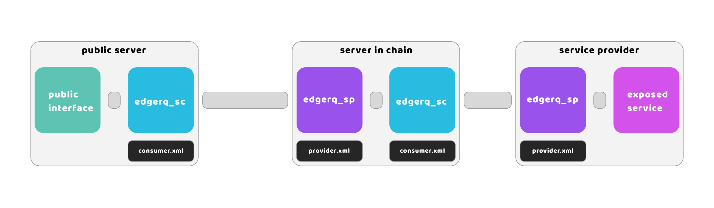
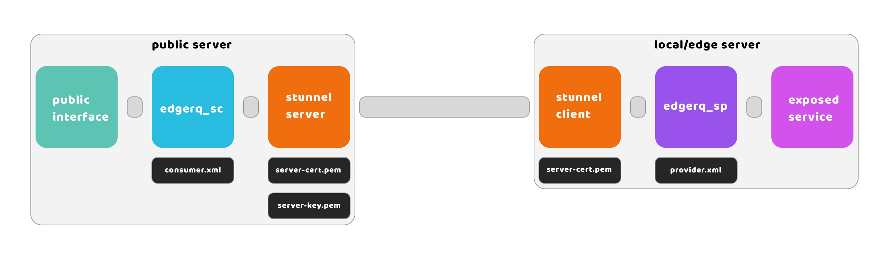
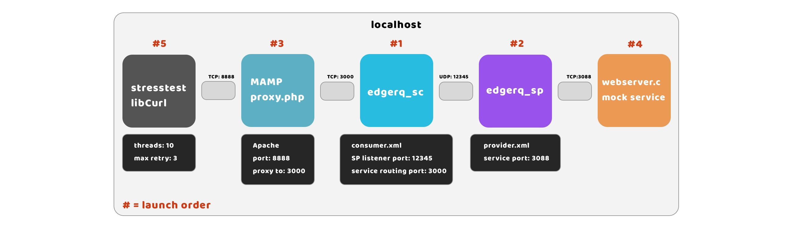
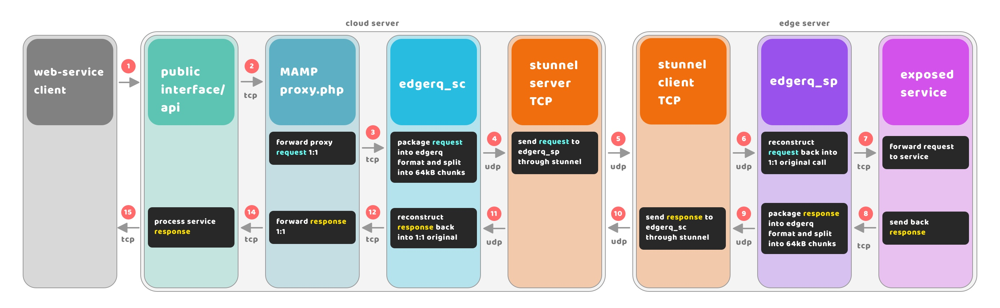

# edgerq

The edgerq tool kit makes it easy to create reverse tunnels and simple overlay networks running through UDP without any complex set-up and access different types of TCP-based services anywhere - be it in a locally hosted infrastructure without a public IP and/or to further route requests to systems that would otherwise not be able to serve these requests.



# edgerq_sc

"SC" stands for Service Consumer. In the EDGERQ tool kit, the SC is meant to act as a server for edgerq_sp from a networking point of view, but in fact, is used to listen on specified ports for HTTP requests and forward them to edgerq_sp through a connection established by edgerq_sp which in turn routes the requests to specified web servers and get back with responses to edgerq_sc.

One use case is that you would install edgerq_sc on a remote server and edgerq_sp in your local infrastructure. You would then configure edgerq_sp to connect to edgerq_sc using UDP. edgerq_sc would be set up to listen for HTTP requests forwarding them back to edgerq_sp to web servers running in your local infrastructure.

It is advised that you do not expose the ports on which edgerq_sc is listening for HTTP requests on a public IP, but instead on localhost on the public server and you forward requests to it from a web interface that needs these other services.



consumer.xml sample:

```xml
<?xml version="1.0" encoding="UTF-8"?>
<service_consumer>
              
  <!-- setup defaults -->
  <max_connections>50</max_connections> <!-- default max connections -->
  <request_buffer>4096</request_buffer> <!-- default request buffer size -->
  <request_ttl>3</request_ttl> <!-- default max TTL for a request -->
          
  <listener>
    <inaddr_any>no</inaddr_any> <!-- listen on any addr? no=localhost only -->
    <port>12345</port>
  </listener>
              
  <services>
    <service>
      <uuid>11111111-2222-3333-4444-555555555555</uuid>
      <name>name_of_service1</name>
      <inaddr_any>no</inaddr_any> <!-- listen on any addr? no=localhost only -->
      <port>3000</port>
      <max_connections>50</max_connections>
      <request_buffer>4096</request_buffer>
      <request_ttl>3</request_ttl>
    </service>
  </services>
</service_consumer>
```

# Internal API

Feel free to implement how you forward requests to edgerq_sc in any way you see fit. In the sample setup I am providing I assume there to be a publicly available web interface (served by Nginx or Apache for instance) and an internal API which would send requests to edgerq_sc to access services it needs from edgerq_sp.

You could also expose an edgerq_sc service port publicly by routing it through another stunnel instance.



# Simple overlay networks

It is possible to chain-link an edgerq_sp feeding requests to another edgerq_sc on the same machine effectively making it possible for requests to jump through multiple machines to get to their destination. To achieve this you would configure another edgerq_sc instance on the same machine as you are running edgerq_sp instead of running web servers on that machine. You would then connect to this edgerq_sp instance from another machine running edgerq_sc. You can chain-link SC and SP instances like this indefinitely taking into account that this increases the time it takes for requests to reach their destination.



You could also chain-link edgerq_sp with an edgerq_sc instance running on another system if it is accessible from edgerq_sp.

I refer to this type of setup as simple overlay networks as the SP component doesn't need to be aware of the nodes between it and the SC component (and vice versa) and services are referred to by their UUID instead of their physical addresses.

# edgerq_sp

**TODO: - documentation for the SP component**

# Security

To connect edgerq_sp to edgerq_sc instances I recommend connecting them through stunnel which works as a TSL encryption proxy. The edgerq toolkit does not provide a way to authenticate an edgerq_sp instance connecting to edgerq_sc using password authentication and running insecure connections is highly discouraged.

I made the decision to leave encryption to projects and people who specifically focus on it as I believe that it would be a security risk to add encryption directly into edgerq while not investing sufficient resources into it. Using a widely used third party TSL encryption proxy reduces risks.



**Howto:**

1 - Generate a private key:
openssl genpkey -algorithm RSA -out server-key.pem

2 - Generate a certificate signing request (CSR):
openssl req -new -key server-key.pem -out server-csr.pem

3 - Generate a self signed certificate from the CSR:
openssl x509 -req -days 365 -in server-csr.pem -signkey server-key.pem -out server-cert.pem

**edgerq_sc stunnel configuration example:**

; Sample stunnel configuration for server

cert = server-cert.pem
key = server-key.pem

[my_service]
accept = 3443 ; Port to listen on
connect = 127.0.0.1:3080 ; Address and port of the internal service

**edgerq_sp stunnel configuration example:**

; Sample stunnel configuration for client

client = yes

[my_remote_service]
accept = 127.0.0.1:2080 ; Local address and port
connect = server_ip:3443 ; Address and port of the server
verify = 2 ; Verify server certificate
CAfile = server-cert.pem ; CA certificate file

# Testing during development

Here is the schematic used during development which you might find useful in case you want to try out EDGERQ on localhost.



We launch edgerq_sc and edgerq_sp on the same machine where we run the MAMP suit - in this case, it's Apache MySQL & PHP running on MacOS, but feel free to use any HTTP server such as Nginx. Note that MySQL is not actually utilized in this example. The sample stresstest program performs requests in multiple threads to the Apache server's sample proxy.php script which in turn just forwards the request together with all attributes to edgerq_sc which in turn forwards this request to edgerq_sp which again forwards the request to the sample webserver we provide which answers every request with a standard answer.

# Data flow

**request:**



**TODO: - flow breakdown**
